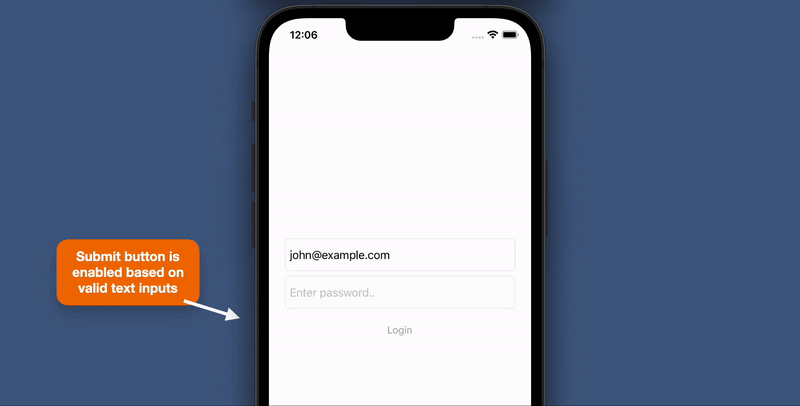

## Description
A simple iOS project for form validation using [Swift Combine](https://developer.apple.com/documentation/combine/receiving-and-handling-events-with-combine).

### Specification

- Xcode 13+
- Swift 5

### License
Licensed under the [MIT license](http://opensource.org/licenses/MIT)
